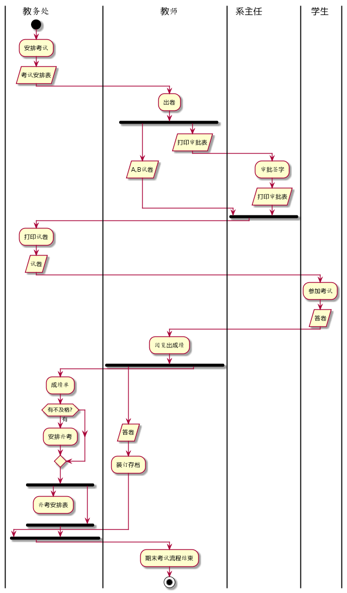
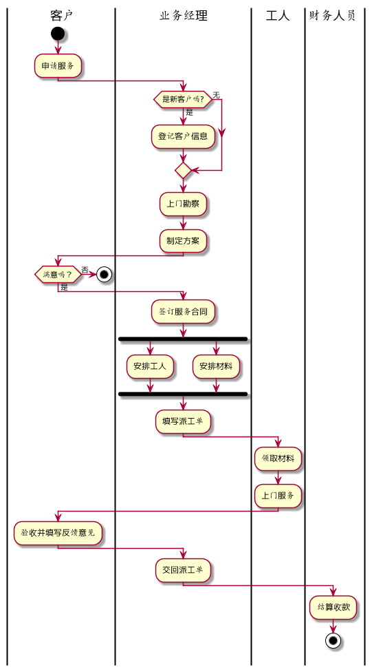

# 实验1
## 考试及成绩管理流程
|学号|班级|姓名|照片|
|:-------:|:-------------: | :----------:|:---:|
|201710414231|软件(本)17-2|周旭波||
```
@startuml
|教务处|
start
:安排考试;
:考试安排表/
|教师|
:出卷;
fork
   :A,B试卷/
fork again
   :打印审批表/
    |系主任|
   :审批签字;
   :打印审批表/
end fork
|教务处|
:打印试卷;
:试卷/
|学生|
:参加考试;
:答卷/
|教师|
:阅览出成绩;
fork
   :答卷/
   :装订存档;
fork again
   |教务处|
   :成绩单;
   if(有不及格?) then(有)
   :安排补考;
   endif
   fork
   :补考安排表/
   detach
   fork again
   end fork
end fork
|教师|
:期末考试流程结束;
stop
@enduml
```



教务处安排考试并制定考试安排表，教师出卷，分为A,B卷并打印审批表，教务处审批签字并打印审核表，教务处再打印试卷，学生参加考试并答卷，之后教师阅卷出成绩并将答卷装订存档，教务处看成绩单是否有不及格的，不及格的安排补考并制定补考安排表

## 客户维修服务流程
```
@startuml
|客户|
start
:申请服务;
|业务经理|
if (是新客户吗?) then(是)
    :登记客户信息;
else(无)
endif
:上门勘察;
:制定方案;
|客户|
if (满意吗？) then(否)
    stop
else(是)
    |业务经理|
    :签订服务合同;
    fork
        :安排工人;
    fork again
        :安排材料;
    fork end
    :填写派工单;
    |工人|
    :领取材料;
    :上门服务;
    |客户|
    :验收并填写反馈意见;
    |业务经理|
    :交回派工单;
    |财务人员|
    :结算收款;
    stop
@enduml
```





客户申请服务，业务经理看是否是新客户，新客户需登记客户信息，然后上门勘察，制订方案，客服是否满意，满意则签订服务合同，业务经理再分别安排工人和材料，再填写派工单，工人领取材料然后上门服务，客户验收并填写反馈意见，业务经理交回派工单，财务人员结算收款。

