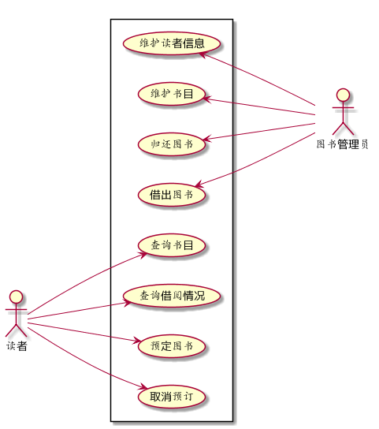
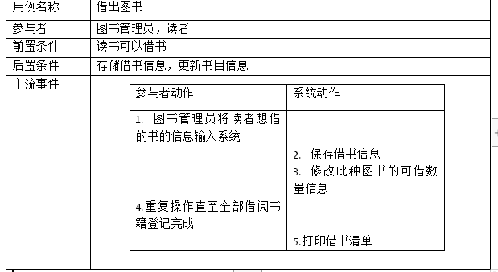

# 图书管理系统用例建模

## 用例图
````
@startuml
left to right direction
actor 图书管理员
actor 读者
rectangle  {
  图书管理员 -up--> (借出图书)
  图书管理员 -up-> (归还图书)
  图书管理员 -up-> (维护书目)
  图书管理员 -up-> (维护读者信息)
  读者 -down--> (查询书目)
  读者 -down-> (查询借阅情况)
  读者 -down-> (预定图书)
  读者 -down-> (取消预订)
}
@enduml
````


##参与者说明：

###图书管理员主要职责是：借出图书 归还图书 维护书目 维护读者信息

###读者主要职责是：查询书目 查询借阅情况 预定图书 取消预订

##用例规约表


##用例流程图

````

````

