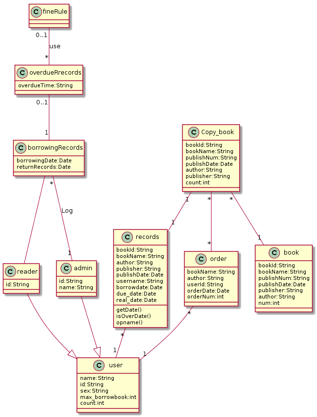
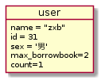
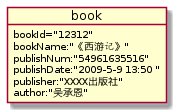

# 实验3 图书管理系统领域对象建模
|学号|班级|姓名|照片|
|:-------:|:-------------: | :----------:|:---:|
|201710414231|软件(本)17-2|周旭波||

## 1. 图书管理系统的类图

### 类图PlantUML源码如下：

```
@startuml
user :  name:String
user :  id:String
user :  sex:String
user :  max_borrowbook:int
user :  count:int
reader : id:String
reader --|> user
borrowingRecords -- reader
borrowingRecords : borrowingDate:Date
borrowingRecords : returnRecords:Date
overdueRrecords"0..1"--"1"borrowingRecords
overdueRrecords : overdueTime:String
fineRule"0..1"--"*"overdueRrecords : "use"
borrowingRecords"*"--"1"admin : "Log"
admin--|>user
admin : id:String
admin : name:String
records"*"--"1"user
records : bookId:String
records : bookName:String
records : author:String
records : publisher:String
records : publishDate:Date
records : username:String
records : borrowdate:Date
records : due_date:Date
records : real_date:Date
records : getDate()
records : isOverDate()
records : opname()
order"*"--"1"user
order : bookName:String
order : author:String
order : userId:String
order : orderDate:Date
order : orderNum:int
Copy_book"*"--"*"order
Copy_book : bookId:String
Copy_book : bookName:String
Copy_book : publishNum:String
Copy_book : publishDate:Date
Copy_book : author:String
Copy_book : publisher:String
Copy_book : count:int
Copy_book"1"--"1"records
Copy_book"*"--"1"book
book : bookId:String
book : bookName:String
book : publishNum:String
book : publishDate:Date
book : publisher:String
book : author:String
book : num:int
@enduml
```

### 1.2. 类图如下：


### 1.3. 类图说明：
主要的人员有用户和admin，关系有借还书，预约等。
admin主要负责登记用户的各种信息。
用户可以在系统上进行预约和借书等操作。

## 2. 图书管理系统的对象图
### 2.1 类user的对象图
#### 源码如下：

``` 
@startuml
object user {
name = "zxb"
id = 31
sex = '男'
max_borrowbook=2
count=1
}
@enduml
``` 
#### 对象图如下：



### 2.2 类admin的对象图
#### 源码如下：
``` 
@startuml
object book {
bookId="12312"
bookName:"《西游记》"
publishNum:"54961635516"
publishDate:"2009-5-9 13:50 "
publisher:"XXXX出版社"
author:"吴承恩"
}
@enduml
``` 
#### 对象图如下：

