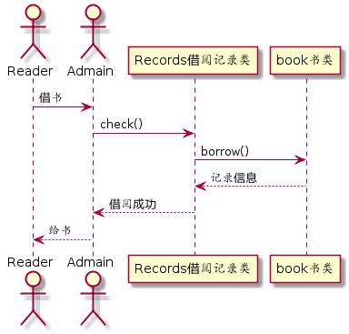
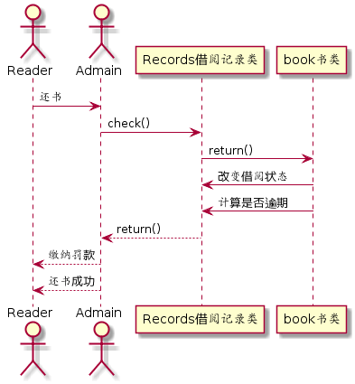

# 实验4：图书管理系统顺序图绘制

## 图书管理系统的顺序图

## 1. 借书用例

## 1.1. 借书用例PlantUML源码
```
@startuml
actor Reader
actor Admain

Reader -> Admain:借书
Admain -> Records借阅记录类:check()
Records借阅记录类 -> book书类:borrow()
book书类 --> Records借阅记录类:记录信息
Records借阅记录类 --> Admain:借阅成功
Admain --> Reader:给书
@enduml
```
## 1.2. 借书用例顺序图


## 1.3. 借书用例顺序图说明


## 2. 还书用例

## 2.1. 还书用例PlantUML源码
```
@startuml
actor Reader
actor Admain

Reader -> Admain:还书
Admain -> Records借阅记录类:check()
Records借阅记录类 -> book书类:return()
book书类 -> Records借阅记录类:改变借阅状态
book书类 -> Records借阅记录类:计算是否逾期
Records借阅记录类 --> Admain:return()
Admain --> Reader:缴纳罚款
Admain --> Reader:还书成功
@enduml
```
## 2.2. 还书用例顺序图



## 2.3. 还书用例顺序图说明
