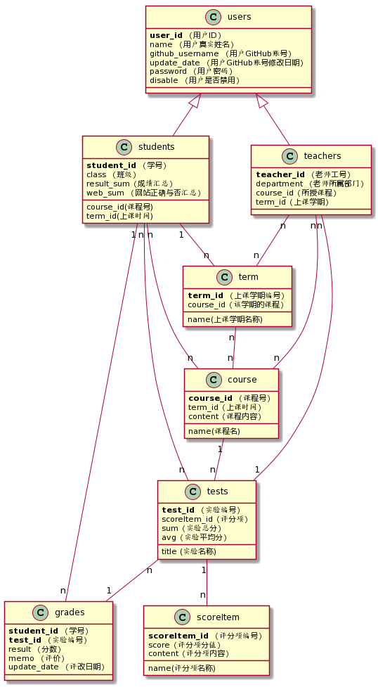

# 基于GitHub的实验管理平台的分析与设计

## 1. 概述

- 基于GitHub的实验管理平台的作用是在线管理实验成绩的Web应用系统。学生和老师的实验内容均存放在GitHUB 页面上。

- 学生的功能主要有：一是设置自己的GitHub用户名，二是查询自己的实验成绩。学生的GitHub用户名是公开的，但成绩不公开。

- 老师的功能主要有：一是批改每个学生的成绩，二是查看每个学生的成绩。

- 老师和学生都能通过本系统的链接方便地跳转到学生的每个GitHUB实验目录，以便批改实验或者查看实验情况。

- 实验成绩按数字分数计算，每项实验的满分为100分，最低为0分。

- 系统自动计算每个学生的所有实验的平均分。

## 2.项目改进

- 用户可以选择所上课的学期。

- 老师和学生可以选择课程。

- 每门课程可以有多个实验，不仅局限于一门课程。

- 每个实验的评分可以由老师设置评分项进行打分，也可以进行评价。

- 每个实验分数由系统自动根据评分项计算得出。

- 每门课程由系统计算各实验分数的平均值进行计算得出。

- 老师和学生都可以查看自己所选或者所授课程的实验成绩情况。

- 学生功能：
    - 登录、登出
    - 选课
    - 修改个人信息
    - 设置github地址
    - 查看实验及实验成绩
    - 查看所选课程信息及课程成绩

- 教师功能：
    - 登录、登出
    - 选课
    - 修改个人信息
    - 发布该课程实验内容及评分项
    - 修改该课程实验内容及评分项
    - 对实验评分项进行打分、评价
    - 查看所有学生实验内容及成绩
    - 修改所有成绩

## 3.系统总体结构图
---

## 4.用例图 [源码](code/用例图.wsd)
---

## 5.类图 [源码](code/类图.wsd)
---

## 6.数据库设计
---

- [数据库详细设计](itemMD/data.md)

## 6.界面设计
---

- [登录界面](https://zxb12138.github.io/is_analysis/test6/image/ui/login.html)

- [首页界面](https://zxb12138.github.io/is_analysis/test6/image/ui/index.html)

- [查看实验成绩界面](https://zxb12138.github.io/is_analysis/test6/image/ui/test-student.html)

- [发布实验界面](https://zxb12138.github.io/is_analysis/test6/image/ui/test-sub.html)

- [评定成绩界面](https://zxb12138.github.io/is_analysis/test6/image/ui/test-teacher.html)

## 7.用例
---

- [学生列表用例](itemMD/yl/students.md)

- [设置github地址用例](itemMD/yl/setGithub.md)

- [选择课程和所上学期用例](itemMD/yl/setCourse.md)

- [查看实验用例](itemMD/yl/searchTest.md)

- [查看成绩用例](itemMD/yl/searchGrades.md)

- [查看课程成绩用例](itemMD/yl/searchCourseGrades.md)

- [修改密码用例](itemMD/yl/rePwd.md)

- [发布实验用例](itemMD/yl/publishTest.md)

- [修改实验用例](itemMD/yl/publishTest.md)

- [登出系统用例](itemMD/yl/loginOut.md)

- [登录系统用例](itemMD/yl/login.md)

- [获取用户信息用例](itemMD/yl/getUserInfo.md)

- [评定成绩用例](itemMD/yl/enterGrades.md)
